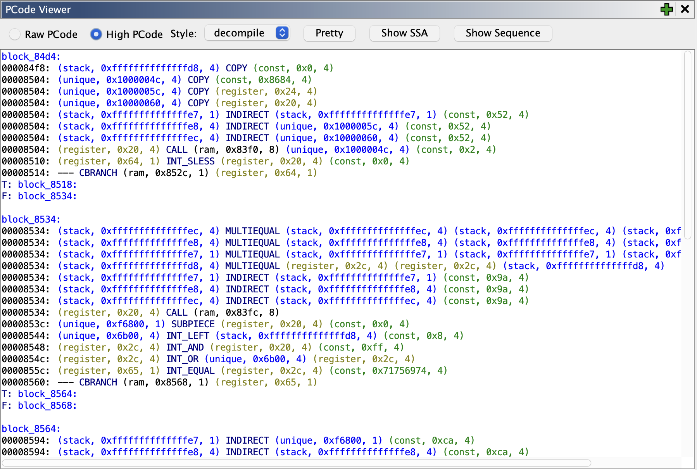
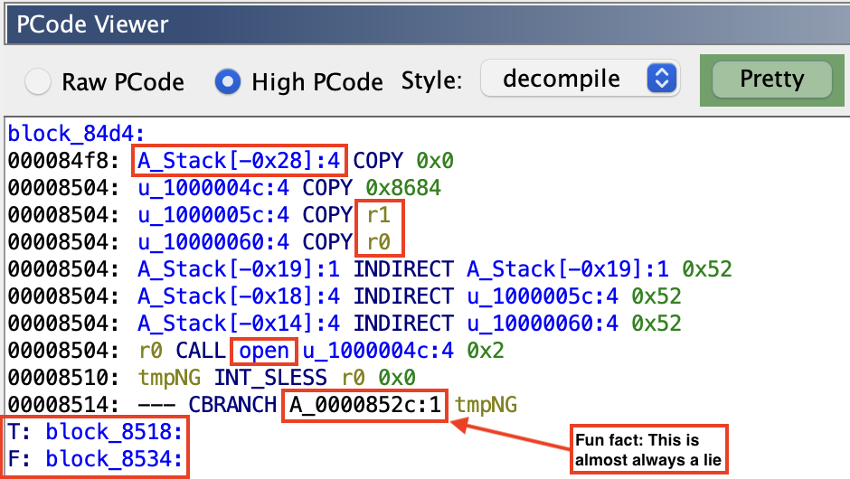
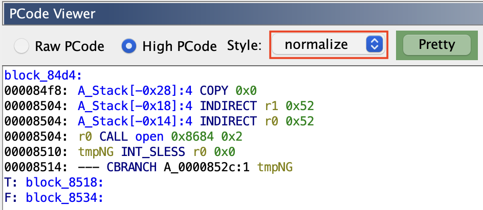
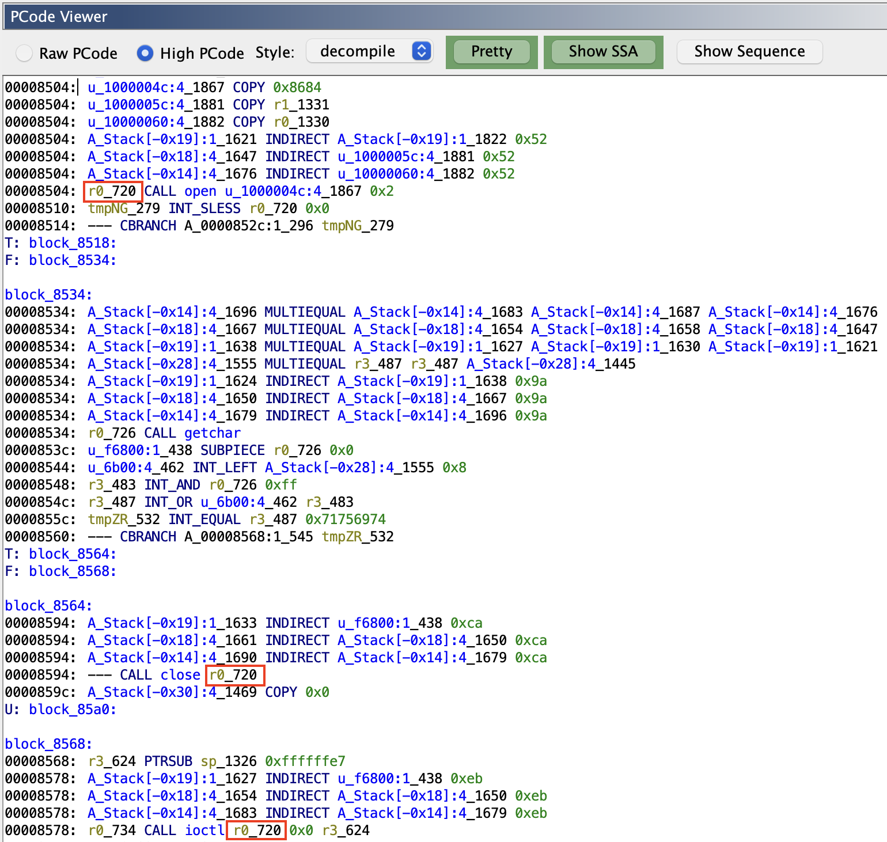
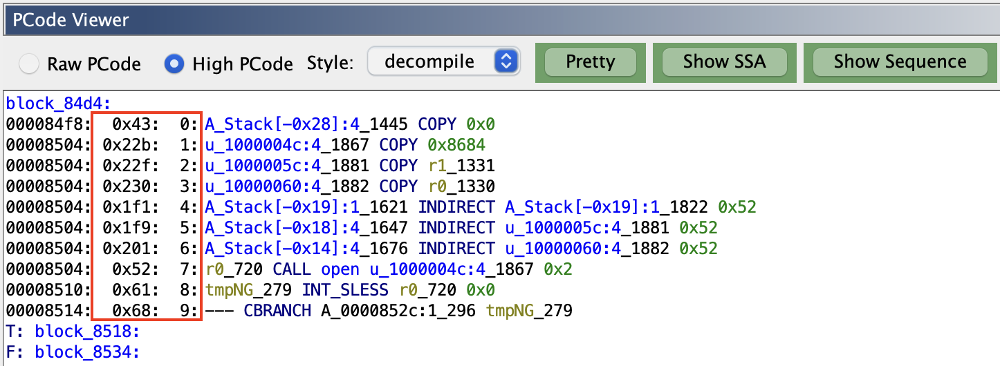

# PCodeViewer - A Ghidra Plugin for Exploring PCode
The idea behind this plugin is to make Ghidra's incredibly powerful PCode a little more accessible from the GUI, as well as add some enhancements to assist those who want to learn to use PCode directly for program analysis. The inspiration behind this is Binary Ninja's treatment of IL as a first-party display in the GUI, which Ghidra is currently lacking.

High PCode default view, with basic control flow information

`Pretty` High PCode: Replaces raw varnode tuple with an architecturally-mapped varnode, and `CALL` targets with function names

Select the simplification style for High PCode (decompile, normalize, firstpass, register, paramid)

Show SSA context (varnode unique ID) as a varnode suffix, where applicable

Show the `SequenceNumber` information for a `PCodeOp`

## Usage
Build it (currently tested with Ghidra 12.0.3) and install it via `File->Install Extensions`. Then restart Ghidra, open a binary, navigate to a function, and go to `Window->PCode Viewer`.

## Building
Use the VS Code module route and avoid Eclipse pain by having Ghidra create a new VS Code module project. Go to `Tools->Create VS Code Module Project...` and then copy the `src` folder over to the project that you specified. You can then go to the `Gradle` sidebar icon and run the `ghidra->Distribute Extension` task.

## Planned Features
1. A `Function Graph` view that displays PCode in a graph view
2. Navigation within the view window (basic blocks, varnode addresses, call targets, etc.)
3. Synchronization with `Listing` and other relevant views
4. Data variable (local and global) representation